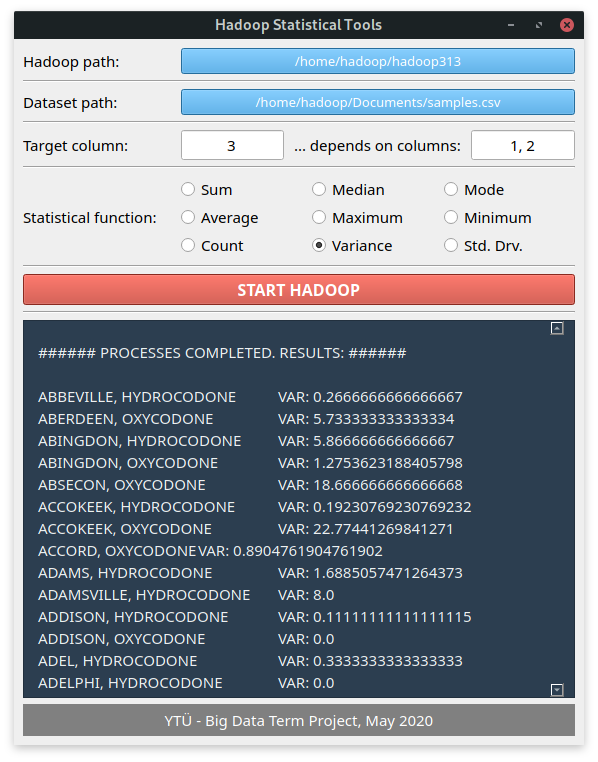

# Hadoop-Statistical-Tools
A software for statistical analysis of big data projects. Hadoop, Java and Qt technologies are used.

### GUI
Qt used for GUI. Communication between Qt and jar file created with command line arguments. Here is a screenshot:

  

